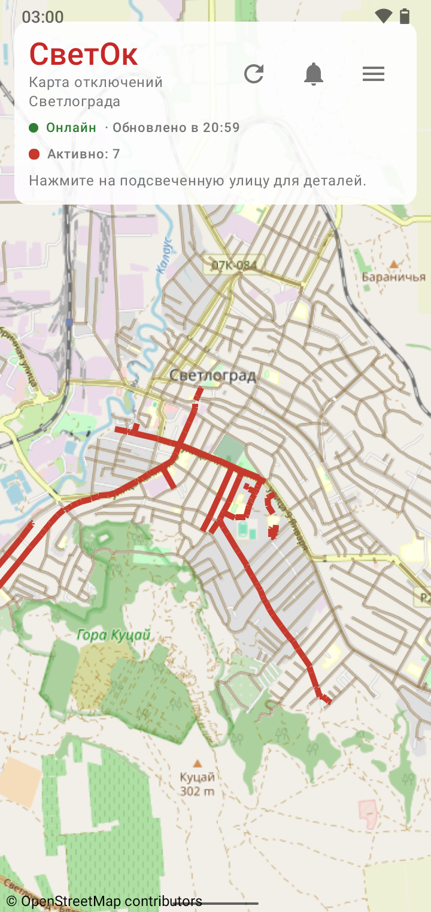
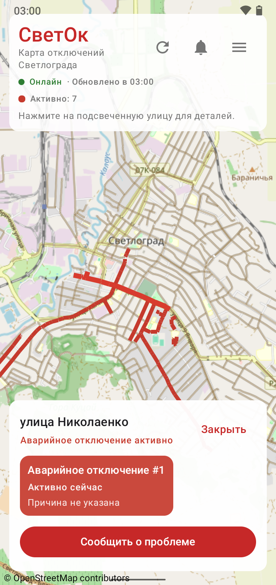
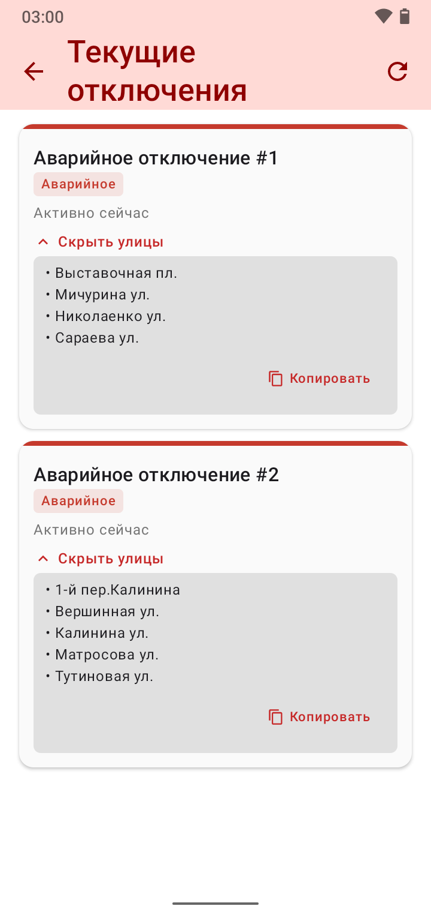
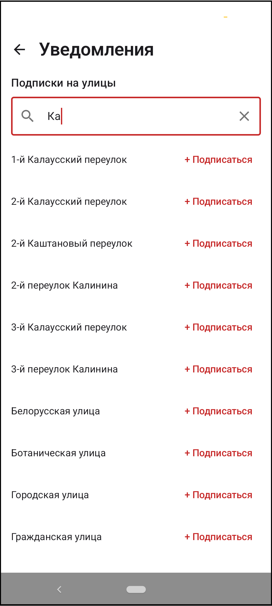
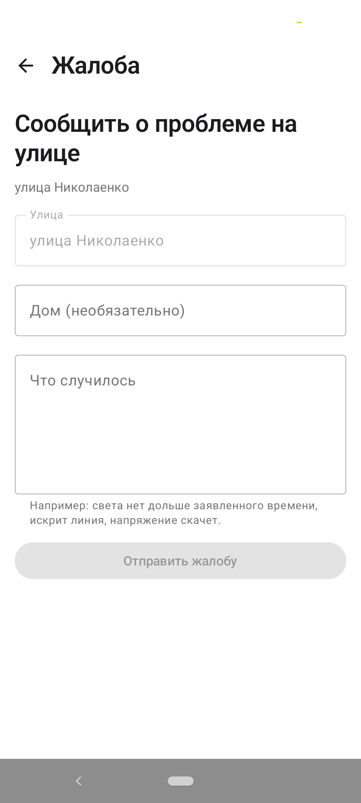
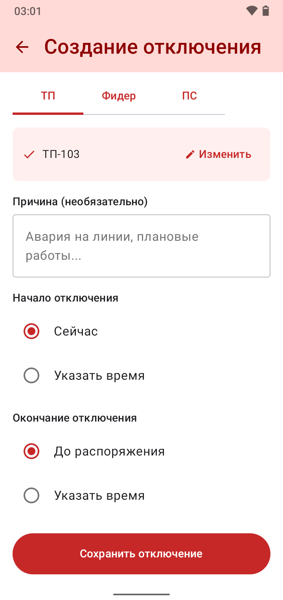

# СветОк Android

Мобильное Android-приложение для мониторинга отключений электроэнергии в небольшом городе. Проект сделан как дипломная работа и демонстрирует полный цикл мобильной разработки: карта, сетевой API, локальный кэш, push-уведомления, пользовательские обращения и встроенный административный сценарий.

В небольших городах информация об аварийных и плановых отключениях часто распространяется через разрозненные сообщения, звонки и неавтоматизированные каналы. «СветОк» решает эту проблему для жителей: пользователь открывает карту, видит затронутые улицы, получает push-уведомления по выбранным адресам и может отправить жалобу, если проблема не отражена в системе.

## Скриншоты

| Карта отключений | Детали улицы | Список отключений |
| --- | --- | --- |
|  |  |  |

| Подписки | Жалоба | Админ-сценарий |
| --- | --- | --- |
|  |  |  |

## Возможности

- Интерактивная карта города на OpenStreetMap/osmdroid.
- Подсветка улиц с активными и запланированными отключениями.
- Детальная карточка выбранной улицы: статус, причина, время, затронутые отключения.
- Автообновление данных каждые 30 секунд.
- Room-кэш, чтобы приложение сохраняло последние полученные отключения при проблемах с сетью.
- Экран текущих отключений со списком затронутых улиц и копированием адресов.
- Отправка жалобы по выбранной улице с номером дома и описанием проблемы.
- Подписка на push-уведомления по конкретным улицам.
- Получение FCM push-уведомлений при создании отключения на backend.
- Скрытый вход администратора и мобильная админ-панель.
- Создание отключений администратором по ТП, фидеру или подстанции.
- Завершение активных отключений из админского интерфейса.
- Локальный GeoJSON улиц в assets для быстрой отрисовки линий на карте.

## Технологии

- Kotlin
- Jetpack Compose
- Material 3
- Compose Navigation
- ViewModel + StateFlow
- Kotlin Coroutines
- Koin
- Ktor Client
- Room
- kotlinx.serialization
- Firebase Cloud Messaging
- osmdroid / OpenStreetMap
- Gradle Version Catalog
- R8/ProGuard для release-сборки

## Архитектура

```text
UI: Compose screens
  |
ViewModels: StateFlow + coroutines
  |
Repositories
  |-- Ktor HTTP API client
  |-- Room cache
  |-- GeoJSON asset parser
  |-- SharedPreferences
  |
Backend API + Firebase Cloud Messaging
```

Основные модули:

- `ui/map` — карта, статусная панель, выбор улицы, скрытый вход администратора.
- `ui/outages` — список текущих отключений.
- `ui/settings` — подписки на push-уведомления по улицам.
- `ui/complaint` — отправка жалоб.
- `ui/admin` — вход, список отключений и создание отключения.
- `data/outage` — API, Room-кэш, модели отключений.
- `data/geo` — чтение `streets.geojson` из assets.
- `data/subscription` — регистрация FCM-токенов и подписок.
- `data/admin` — admin API и хранение сессии.

## Связь с backend

Приложение работает с backend-репозиторием `SvetOk-API`. Android-клиент обращается к FastAPI и передает общий клиентский токен в HTTP-заголовке:

```http
X-Svetok-Api-Key: <API_CLIENT_TOKEN>
```

Используемые API-сценарии:

- получить активные отключения;
- отправить жалобу;
- создать/удалить push-подписку;
- войти в админ-панель;
- получить сетевые объекты для создания отключения;
- создать или завершить отключение.

Если API недоступен или конфигурация пустая, публичная карта и список отключений используют локальный Room-кэш либо пустое состояние.

## Что не публикуется

В репозиторий не входят:

- `app.local.properties` с API URL и клиентским токеном;
- настоящий `app/google-services.json` Firebase-проекта;
- `local.properties` с локальным Android SDK path;
- `keystore.properties`;
- release keystore (`*.jks`, `*.keystore`);
- APK/AAB-файлы и Gradle build-кэш.

`app/src/main/assets/streets.geojson` намеренно оставлен в проекте, потому что карта приложения зависит от этих данных.

## Локальная настройка

1. Скопировать шаблон конфигурации:

```powershell
Copy-Item app.local.properties.example app.local.properties
```

2. Заполнить `app.local.properties`:

```properties
API_BASE_URL=https://your-api-host.example
API_CLIENT_TOKEN_A=part-a
API_CLIENT_TOKEN_B=part-b
```

`API_CLIENT_TOKEN_A + API_CLIENT_TOKEN_B` должны давать полный `API_CLIENT_TOKEN` из backend `.env`.

3. Для FCM скопировать Firebase config:

```powershell
Copy-Item app\google-services.example.json app\google-services.json
```

Затем заменить значения в `app/google-services.json` файлом из Firebase Console. Если файла нет, проект всё равно можно собрать, но Firebase Messaging не будет полноценно настроен.

4. Собрать debug-версию:

```powershell
.\gradlew.bat :app:assembleDebug
```

## Статус проекта

`СветОк` — дипломный проект и рабочий прототип городской системы уведомлений об отключениях. Кодовая база демонстрирует не только интерфейс, но и интеграцию с реальным backend, push-инфраструктурой, локальным кэшем, картографией и административными сценариями.
